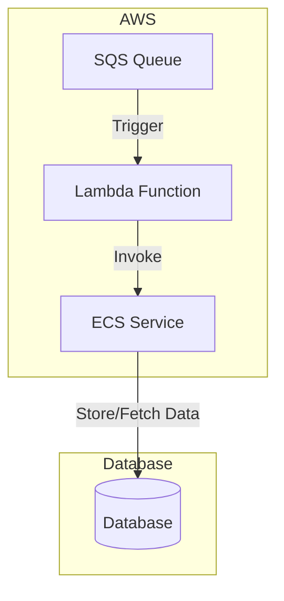

# gateway

## Diagrams

## Code Generation

This repository defines its models in openapi format.

Generated code should not be checked in the repository, as it should be generated on CI and check interfaces are implemented accordingly.

