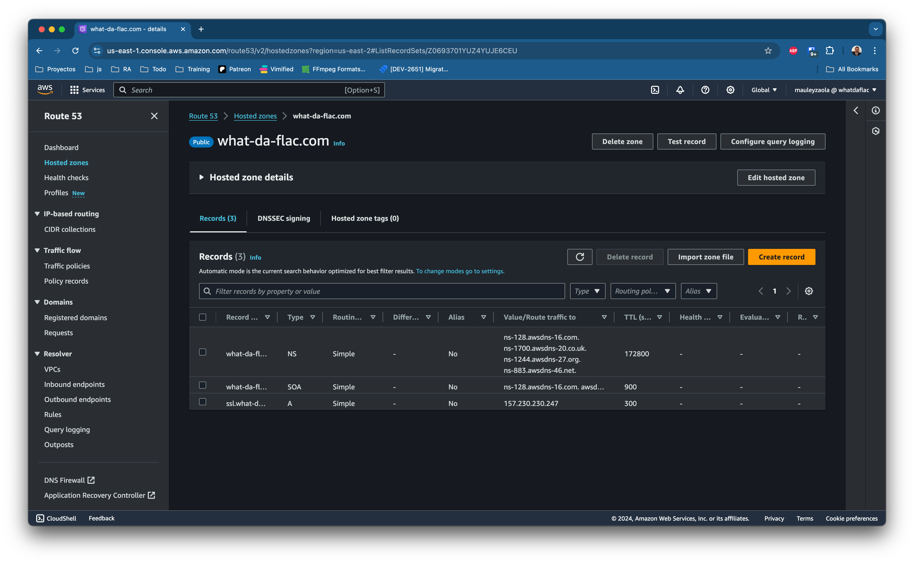
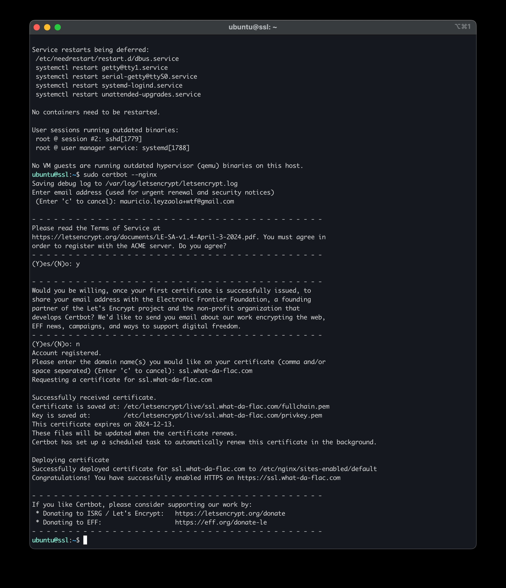
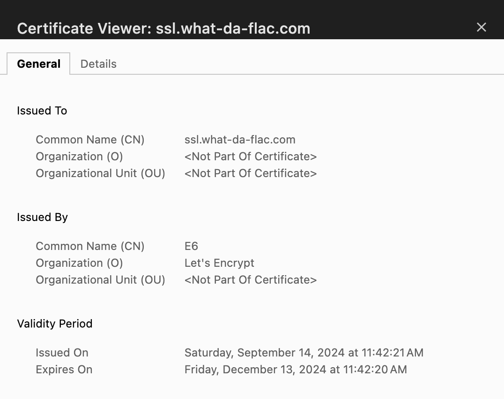

# deployment

This document is a guide to configure NGINX with SSL and allow remote deployments from any
triggering system.

Procedure is based on this Linux distro

```shell
ubuntu@ssl:~$ lsb_release -a
No LSB modules are available.
Distributor ID:	Ubuntu
Description:	Ubuntu 24.04.1 LTS
Release:	24.04
Codename:	noble
```

## SSL with NGINX

### Prepare Certbot

```shell
sudo apt update
sudo apt install -y certbot python3-certbot-nginx nginx
sudo certbot --nginx
```

Certbot will automatically configure your Nginx configuration files. However, you can verify the
changes by checking your Nginx configuration file. Certbot typically adds the SSL block under
your server block. You should see something like this in the configuration:

```shell
server {
    listen 80;
    server_name yourdomain.com www.yourdomain.com;
    return 301 https://$host$request_uri;
}

server {
    listen 443 ssl;
    server_name yourdomain.com www.yourdomain.com;

    ssl_certificate /etc/letsencrypt/live/yourdomain.com/fullchain.pem;
    ssl_certificate_key /etc/letsencrypt/live/yourdomain.com/privkey.pem;
    include /etc/letsencrypt/options-ssl-nginx.conf;
    ssl_dhparam /etc/letsencrypt/ssl-dhparams.pem;

    # Your existing configuration
}
```

### Reload Nginx

After obtaining the SSL certificate, reload Nginx to apply the changes:

```shell
sudo systemctl reload nginx
```

### Automate Certificate Renewal

Certbot automatically sets up a cron job for certificate renewal, but you can verify it by running:

```shell
sudo systemctl status certbot.timer
```

You can manually test the renewal process with:

```shell
sudo certbot renew --dry-run
```

### Outcome




